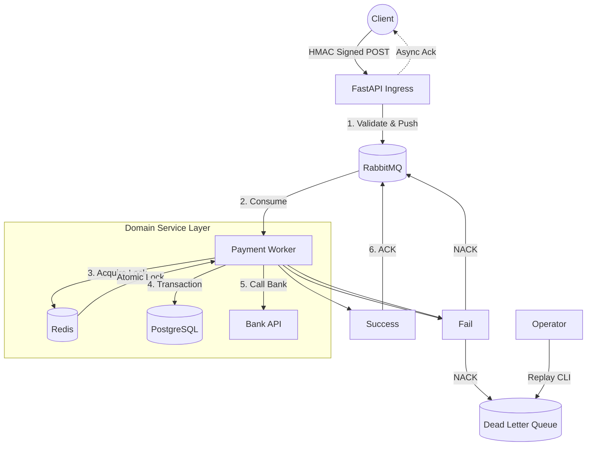

# FlowPay - High-Performance Distributed Payment System


FlowPay 是一個模擬真實高併發場景的 **分散式金流處理系統**。
採用 **事件驅動架構 (Event-Driven Architecture)** 設計，旨在解決傳統金流系統在雙 11 等高流量場景下的「阻塞」與「掉單」問題。

本專案實作了完整的 **削峰填谷**、**冪等性防護**、**分散式鎖** 以及 **死信容錯機制**。


## 🏗 System Architecture (系統架構)

系統採用 **微服務拆分** 策略，將 API 接收端與業務處理端解耦，透過 RabbitMQ 進行非同步溝通。



## 🚀 Key Features (核心亮點)

### 1. 高併發與非阻塞 (High Concurrency)
- 使用 **FastAPI (Asynchronous)** 作為入口，僅負責簽名驗證與訊息推播，將響應時間壓至毫秒級。
- 利用 **RabbitMQ** 進行流量削峰 (Peak Shaving)，防止資料庫在高流量下崩潰。

### 2. 資料一致性與冪等 (Consistency & Idempotency)
- **Redis 分散式鎖 (`SETNX`)**：防止同一個 Webhook 在極短時間內重複觸發 (Race Condition)。
- **資料庫唯一索引 (Unique Constraint)**：作為最後一道防線，確保 `order_id` 絕對唯一。

### 3. 高可靠性與容錯 (Reliability)
- **Dead Letter Queue (DLQ)**：處理失敗或格式錯誤的訊息會自動轉移至死信隊列，防止阻塞主隊列，實現「零掉單」。
- **Replay Mechanism**：提供 CLI 工具 (`apps/cli/replay_dlq.py`)，在修復問題後可將死信重新回放。
- **Graceful Shutdown**：Worker 支援信號處理 (`SIGTERM`)，確保關機時不會中斷正在處理的交易。

### 4. 安全性 (Security)
- **HMAC-SHA256 簽名驗證**：確保 Webhook 請求未被篡改，且來自可信來源。

---

## 🛠 Tech Stack (技術棧)

*   **Language:** Python 3.11+
*   **Web Framework:** FastAPI
*   **Message Broker:** RabbitMQ (with DLX configuration)
*   **Cache & Lock:** Redis
*   **Database:** PostgreSQL 15
*   **ORM:** SQLModel (SQLAlchemy 2.0)
*   **Testing:** Pytest, HTTPX, K6 (Load Testing)
*   **DevOps:** Docker, Docker Compose, GitHub Actions

---

## ⚡ Quick Start (快速啟動)

### 1. 啟動基礎設施
使用 Docker Compose 一鍵啟動 DB, MQ, Redis, API 和 Worker。

```bash
docker-compose up -d --build
```

### 2. 資料庫遷移
初始化資料表結構。

```bash
# 確保已安裝依賴: pip install -r requirements.txt
alembic upgrade head
```

### 3. 執行測試
包含單元測試與 E2E 整合測試。

```bash
# 執行所有測試
pytest tests/

# 執行壓力測試腳本 (模擬 500+ 併發)
python tests/e2e/test_concurrency.py
```

---

## 📂 Project Structure (專案結構)

採用 **Vertical Slice Architecture** (依功能模組分層)：

```text
FlowPay/
├── apps/                   # 應用程式入口
│   ├── api/                # FastAPI 接口 (Ingress)
│   ├── worker/             # RabbitMQ 消費者 (Consumer)
│   └── cli/                # 維運工具 (Replay DLQ)
├── core/                   # 基礎設施層 (DB, Redis, MQ Config)
├── domains/                # 業務邏輯層 (DDD)
│   └── payment/            # 金流領域核心 (Model, Service, Schema)
├── tests/                  # 測試案例 (Unit & E2E)
├── migrations/             # Alembic 資料庫版本控制
└── deploy/                 # Docker 設定檔
```

---

## 📊 Performance Benchmarks (壓測數據)

----------------------------------------
Report:
   Total Requests: 500
   Success:        500
   Failed:         0
   Total Time:     3.16s
   TPS (Approx):   158.37 req/s
----------------------------------------

```
